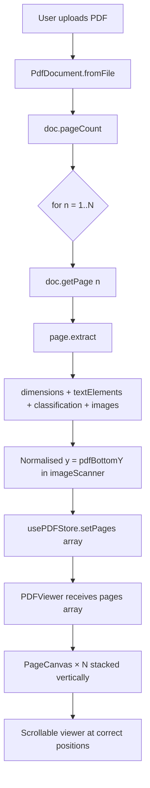

# Implementation Plan — Edit Page: Accurate PDF Rendering

## Goal

Fix the editing page so the user sees a pixel-accurate reconstruction of every page in their uploaded PDF — images at the right position, text at the right position, with the full multi-page document visible in a scrollable viewer.

---

## Root-Cause Analysis

### Bug 1 — Image Y-coordinate is wrong (the main culprit)

PDF images are painted via a CTM (Current Transformation Matrix):
```
[a  b  c  d  e  f] cm
/Im0 Do
```
where `a` = rendered width, `d` = rendered height, `e` = x-position, `f` = y-position.

**Critical detail:** Many PDF generators flip images vertically by using a **negative `d`**.

| `d` sign | What `f` (matrix[5]) means |
|----------|----------------------------|
| `d > 0`  | **Bottom**-left of the image in PDF space |
| `d < 0`  | **Top**-left of the image in PDF space |

**Current code in `imageScanner.js`** always stores `y: op.matrix[5]` unconditionally, then `PDFViewer.jsx` always subtracts `renderedHeight` to convert to CSS top:
```js
// toCanvasY(img.y, img.renderedHeight, pageHeight, scale)
cssY = (pageHeight - img.y - img.renderedHeight) * scale
```

**Example of the failure** — a full-page background image with `d = -792, f = 792`:
- Current code: `cssY = (792 - 792 - 792) * scale = -792 * scale` → image drawn 792px **above** the page 🐛
- Correct:      `cssY = (792 - 792) * scale = 0` → top of page ✓

**The fix:** normalise all appearance `y` values to be **bottom-left in PDF space** before storing them. Then `toCanvasY` works correctly in all cases.

---

### Bug 2 — Text Y uses wrong height for baseline correction

In PDF, the `Tm` operator gives the **baseline** Y of the text. The current code:
```js
// PDFViewer.jsx
const cssY = toCanvasY(el.y, el.fontSize ?? 12, pageHeight, scale);
// = (pageHeight - el.y - fontSize) * scale
```
This subtracts a full `fontSize` from the baseline, placing the **top of the div** one full em above the baseline. But since the div's text has a baseline at ~`0.8em` from the div top, the visual baseline ends up `0.2em` too high — causing text to overlap images above it instead of sitting neatly below them.

**The fix:** subtract only `fontSize * 0.8` (the standard ascent fraction) so the div top aligns with the top of the glyph bounding box, not above it.

---

### Bug 3 — Only page 1 is ever parsed or displayed

- `PdfDocument.#resolvePageN(n)` calls `extractFirstKid()` which **always returns Kids[0]**, ignoring `n`.
- `PdfPageTreeResolver` has no function to extract the Nth kid.
- `EditingPage.jsx` hard-codes `doc.getPage(1)` and never loops pages.
- `PDFViewer.jsx` accepts only one page's data and renders a single fixed-height box.
- `usePDFStore` holds only one page's content.

---

### Bug 4 — Background detector misclassifies regular images as background

In `backgroundDetector.js`, `detectBackgroundObject` has a **fallback** that was intended as a last resort:

```js
// If no image covers ≥80%, return the one with the most coverage anyway
return bestObjNum !== null ? { objNum: bestObjNum, matrix: bestMatrix } : null;
```

**The problem:** Any PDF whose images don't cover ≥80% of the page (most normal PDFs with photos, diagrams, etc.) still gets its largest image flagged as "background" — even if it covers only 5% of the page. This means all images get assigned `role: 'background'` and end up in `images.background` instead of `images.pageImages`. Layer 1 (page images) is always empty.

**The fix:** Remove the fallback entirely. Only return a background when an image genuinely covers ≥80% of the page.

```js
// After: strict threshold only
return null;  // Only classify as background if coverage ≥ 80%
```

---

### Bug 5 — `targetPageObj` string comparison in `scanPageImages` always fails, emptying `pageImages`

In the previous plan, `scanPageImages` was given a `targetPageObj` parameter to restrict scanning to one page:

```js
if (targetPageObj && pageObjStr !== targetPageObj) continue;
```

**The problem:** `targetPageObj` is `this.#pageObj` from `getObject()` which returns just the dictionary content (e.g. `<< /Type /Page ... >>`). But `pageObjStr` in the loop is `match[0]` from a different regex (`PDF_REGEX.images.pageObjectBlock`) which includes the full object header (`5 0 obj\n<< /Type /Page ... >>\nendobj`). **These two strings are structurally different and will never be equal**, so the `continue` fires for every page — `allObjectIds` ends up empty — and `pageImages` is always `[]`.

Combined with Bug 4, this means:
- ALL images get put into `images.background` (Bug 4)
- `images.pageImages` is always empty (Bug 5)
- Commenting out Layer 0 reveals nothing, because pageImages is empty

**The fix:** Remove `targetPageObj` from `scanPageImages` entirely. Instead, in `PdfPage.getImages()`, build the XObject name map from `this.#pageObj` to get the set of object numbers that belong to this page, then filter `scanPageImages` results by those object numbers:

```js
// In PdfPage.getImages()
const nameMap     = buildXObjectNameMap(this.#bytes, this.#pdfString, this.#pageObj);
const pageObjNums = new Set(nameMap.values());

let pageImgs = await scanPageImages(this.#bytes, this.#pdfString);
pageImgs = pageImgs.filter(img => pageObjNums.has(img.objNum));  // ← correct filter
```

This is reliable because `buildXObjectNameMap` operates directly on `this.#pageObj` — the same string used everywhere else for this page.

---

### Bug 6 — Page image coordinates read from wrong location (`undefined` → `NaN` position)

In `PDFViewer.jsx`, the `PageCanvas` sub-component renders page images like this:

```jsx
{(images.pageImages ?? []).map((img, idx) => {
  const cssX = img.x * scale;              // img.x is undefined!
  const cssY = toCanvasY(img.y, img.renderedHeight, pageHeight, scale);
  const cssW = img.renderedWidth * scale;
  const cssH = img.renderedHeight * scale;
```

**The problem:** Image objects returned by `scanPageImages` have the shape:

```js
{
  dataUrl, metadata, format, extension,  // decoded image data
  objNum,
  role: 'image',
  appearances: [
    { x, y, renderedWidth, renderedHeight }  // ← position/size is HERE
  ]
}
```

The properties `x`, `y`, `renderedWidth`, `renderedHeight` **do not exist at the top level** of the image object — they live inside `img.appearances[0]`. So `img.x` is `undefined`, `img.x * scale` is `NaN`, and the image is rendered at position `NaN` — which browsers silently interpret as `0` or ignore, causing all images to pile up at the top-left corner of the page regardless of their actual position in the PDF.

**The fix:** Read position/size data from `img.appearances[0]` in `PageCanvas`:

```jsx
{(images.pageImages ?? []).map((img, idx) => {
  const ap = img.appearances?.[0];
  if (!ap) return null;  // skip images with no paint occurrence on this page

  const cssX = ap.x * scale;
  const cssY = toCanvasY(ap.y, ap.renderedHeight, pageHeight, scale);
  const cssW = ap.renderedWidth * scale;
  const cssH = ap.renderedHeight * scale;
```

> [!NOTE]
> An image can appear more than once on a page (e.g., a repeated watermark). If needed, map over `img.appearances` instead of `appearances[0]` to render every occurrence. For now, rendering the first appearance is sufficient.

---

## Decisions

> [!NOTE]
> **D1 — Multi-page extraction strategy:** All pages are extracted **upfront** on upload (simpler, consistent). Lazy extraction can be added later as an optimisation for very large PDFs if needed.

> [!NOTE]
> **D2 — Page separator styling:** Each page in the scrollable viewer will have a **subtle drop-shadow + page number badge** for a professional look.

---

## Proposed Changes

### Layer 1 — `pdf-parser` SDK (coordinate normalisation + multi-page)

---

#### [MODIFY] [pdfPageTreeResolver.js](file:///c:/Users/Krishanu/OneDrive/Desktop/Learning%20Coding/PDF-Editor/pdf-parser/src/core/pdfPageTreeResolver.js)

Add `extractKidN(pagesObjStr, refId, n)` alongside the existing `extractFirstKid`.

```js
/**
 * Extracts the Nth (0-indexed) child reference from a /Kids array.
 */
export function extractKidN(pagesObjStr, refId, n) {
    const kidsMatch = pagesObjStr.match(PDF_REGEX.core.kidsArray);
    if (!kidsMatch) throw new Error(`/Kids not found in ${refId}`);
    const tokens = kidsMatch[1].trim().split(PDF_REGEX.common.whitespace);
    const base   = n * 3;   // each ref = "ObjNum GenNum R" = 3 tokens
    if (base + 2 >= tokens.length) throw new Error(`Page ${n + 1} out of range`);
    return `${tokens[base]} ${tokens[base + 1]} ${tokens[base + 2]}`;
}

/**
 * Returns the total page count from a /Count entry.
 */
export function extractPageCount(pagesObjStr) {
    const match = pagesObjStr.match(/\/Count\s+(\d+)/);
    return match ? parseInt(match[1], 10) : 1;
}
```

> [!NOTE]
> `extractFirstKid` is kept unchanged — it is still used in non-critical paths and keeping it avoids any breakage.

---

#### [MODIFY] [PdfDocument.js](file:///c:/Users/Krishanu/OneDrive/Desktop/Learning%20Coding/PDF-Editor/pdf-parser/PdfDocument.js)

1. Add `get pageCount()` — reads `/Count` from the Pages node.
2. Fix `#resolvePageN(n)` to call `extractKidN(pagesObj, pagesRef, n - 1)` so page numbers are respected.

```js
// New getter
get pageCount() {
    const rootRef  = findRootRef(this.#pdfString);
    const rootObj  = getObject(this.#bytes, this.#pdfString, rootRef);
    const pagesRef = extractValue(rootObj, '/Pages');
    const pagesObj = getObject(this.#bytes, this.#pdfString, pagesRef);
    return extractPageCount(pagesObj);
}

// Fix #resolvePageN to use extractKidN
const pageRef = extractKidN(pagesObj, pagesRef, n - 1);  // n is 1-indexed
```

---

#### [MODIFY] [imageScanner.js](file:///c:/Users/Krishanu/OneDrive/Desktop/Learning%20Coding/PDF-Editor/pdf-parser/src/images/imageScanner.js)

**This is the most critical bug fix.** Normalise `y` to always be the **bottom-left** Y in PDF user-space before storing it in `appearances`:

```js
// In buildAppearancesForPage → the push inside the loop:
const d           = op.matrix[3];   // y-scale (may be negative = image flipped)
const f           = op.matrix[5];   // PDF y of image origin
// When d < 0, f is the TOP of the image → bottom = f + d (f + negative)
const pdfBottomY  = d < 0 ? f + d : f;

appearancesMap.get(objNum).push({
    x:              op.matrix[4],
    y:              pdfBottomY,          // ← always bottom-left, safe for toCanvasY
    renderedWidth:  Math.abs(op.matrix[0]),
    renderedHeight: Math.abs(d),
});
```

---

#### [MODIFY] [backgroundDetector.js](file:///c:/Users/Krishanu/OneDrive/Desktop/Learning Coding/PDF-Editor/pdf-parser/src/images/backgroundDetector.js)

Two fixes in this file:

**1. Y-normalisation** in `extractBackgroundImage` (appearances array):

```js
const d          = matrix[3];
const f          = matrix[5];
const pdfBottomY = d < 0 ? f + d : f;

appearances: [{
    x:              matrix[4],
    y:              pdfBottomY,          // ← normalised
    renderedWidth:  Math.abs(matrix[0]),
    renderedHeight: Math.abs(d),
}]
```

**2. Remove fallback in `detectBackgroundObject`** (Bug 4 fix):

```js
// Remove this line:
// return bestObjNum !== null ? { objNum: bestObjNum, matrix: bestMatrix } : null;

// Replace with:
return null;  // Only classify as background if coverage ≥ 80%
```

> [!NOTE]
> The `computePageCoverage` function already uses `Math.abs(matrix[0]) * Math.abs(matrix[3])` so it's unaffected.

---

#### [MODIFY] [imageScanner.js](file:///c:/Users/Krishanu/OneDrive/Desktop/Learning%20Coding/PDF-Editor/pdf-parser/src/images/imageScanner.js)

> [!CAUTION]
> The `targetPageObj` parameter added in the previous plan is **removed** (Bug 5 fix). The string comparison `pageObjStr !== targetPageObj` between two differently-sourced strings always fails, causing `pageImages` to be permanently empty.

`scanPageImages` reverts to scanning all pages; per-page filtering is handled in `PdfPage.getImages()` by object number (see below):

```js
// Correct signature — no targetPageObj:
export async function scanPageImages(bytes, pdfString)
```

---

#### [MODIFY] [PdfPage.js](file:///c:/Users/Krishanu/OneDrive/Desktop/Learning%20Coding/PDF-Editor/pdf-parser/PdfPage.js)

Replace the broken `targetPageObj` string filter with an **object-number-based filter** (Bug 5 fix):

```js
import { buildXObjectNameMap } from './src/images/pageContentParser.js';

async getImages() {
    const bg = await extractBackgroundImage(...);

    // Get all object numbers that belong to THIS page
    const nameMap     = buildXObjectNameMap(this.#bytes, this.#pdfString, this.#pageObj);
    const pageObjNums = new Set(nameMap.values());

    // Scan full PDF but filter to this page's objects only
    let pageImgs = await scanPageImages(this.#bytes, this.#pdfString);
    pageImgs = pageImgs.filter(img => pageObjNums.has(img.objNum));

    if (bg) {
        pageImgs = pageImgs.filter(img => img.objNum !== bg.objNum);
    }

    return { background: bg, pageImages: pageImgs };
}
```

---

### Layer 2 — Frontend State (`usePDFStore`)

---

#### [MODIFY] [usePDFStore.js](file:///c:/Users/Krishanu/OneDrive/Desktop/Learning%20Coding/PDF-Editor/frontend/src/store/usePDFStore.js)

Change the store to hold an **array of page data** instead of a single page:

```js
// Before
extractedContent: null,   // single page
extractedImages: null,    // single page
pageDimensions: { width: 612, height: 792 },

// After
pages: [],   // Array<{ dimensions, textElements, classification, images }>
pageCount: 0,
```

Add `setPages(pagesArray)` and `setPageCount(n)` actions. Remove `setExtractedData` / `setPageDimensions`.

---

### Layer 3 — Frontend Orchestration (`EditingPage.jsx`)

---

#### [MODIFY] [EditingPage.jsx](file:///c:/Users/Krishanu/OneDrive/Desktop/Learning%20Coding/PDF-Editor/frontend/src/pages/EditingPage.jsx)

Replace the single-page extraction loop with a multi-page loop:

```js
const doc   = await PdfDocument.fromFile(currentPDF);
const count = doc.pageCount;
const pages = [];

for (let n = 1; n <= count; n++) {
    const page   = await doc.getPage(n);
    const result = await page.extract();
    pages.push(result);   // { dimensions, textElements, classification, images }
}

setPages(pages);
setPageCount(count);
```

Remove `setPageDimensions` / `setExtractedData` calls; replace with `setPages`.

Pass `pages` array to `PDFViewer`.

---

### Layer 4 — Frontend Rendering (`PDFViewer.jsx`)

---

#### [MODIFY] [PDFViewer.jsx](file:///c:/Users/Krishanu/OneDrive/Desktop/Learning%20Coding/PDF-Editor/frontend/src/components/PDFViewer.jsx)

This is the most significant frontend change. Three sub-fixes:

**A. Fix `toCanvasY` for text (baseline correction)**

```js
// Before (subtracts full fontSize → baseline ends up too high)
const cssY = toCanvasY(el.y, el.fontSize ?? 12, pageHeight, scale);

// After (subtract only the ascent fraction ~80% of fontSize)
const ascent = (el.fontSize ?? 12) * 0.8;
const cssY   = toCanvasY(el.y, ascent, pageHeight, scale);
```

**B. Convert from single-page props to `pages` array prop**

```jsx
// Before
const PDFViewer = ({ pageWidth, pageHeight, textElements, classification, images, ... }) => { ... }

// After
const PDFViewer = ({ pages = [], isLoading, selectedTool }) => { ... }
```

**C. Scrollable multi-page layout**

Wrap all page canvases in a `div` with `overflow-y: auto` and a fixed `maxHeight` (e.g., `calc(100vh - 180px)`). Each page renders as its own absolute-positioned box, stacked vertically with a gap:

```jsx
<div
  id="pdf-scroll-container"
  style={{
    overflowY: 'auto',
    maxHeight: 'calc(100vh - 180px)',
    background: '#e5e7eb',    // grey inter-page area
    padding: '24px 0',
    display: 'flex',
    flexDirection: 'column',
    alignItems: 'center',
    gap: 24,
  }}
>
  {pages.map((page, pageIdx) => (
    <PageCanvas
      key={pageIdx}
      page={page}
      pageNumber={pageIdx + 1}
      selectedTool={selectedTool}
    />
  ))}
</div>
```

Extract a `PageCanvas` sub-component that receives one page's `{ dimensions, textElements, classification, images }` and renders the 3 layers (background → page images → text) exactly as the current code does for a single page, but with the **fixed coordinate normalisation**.

**D. Read position from `img.appearances[0]` in `PageCanvas`** — Bug 6 fix

> [!CAUTION]
> The current code reads `img.x`, `img.y`, `img.renderedWidth`, `img.renderedHeight` at the top level of the image object. These properties are `undefined` — they live inside `img.appearances[0]`. All images therefore render at `NaN` coordinates (visually: top-left corner).

```jsx
// Before (WRONG — img.x is undefined)
const cssX = img.x * scale;
const cssY = toCanvasY(img.y, img.renderedHeight, pageHeight, scale);
const cssW = img.renderedWidth * scale;
const cssH = img.renderedHeight * scale;

// After (CORRECT — read from appearances[0])
const ap = img.appearances?.[0];
if (!ap) return null;  // no paint occurrence recorded for this page

const cssX = ap.x * scale;
const cssY = toCanvasY(ap.y, ap.renderedHeight, pageHeight, scale);
const cssW = ap.renderedWidth * scale;
const cssH = ap.renderedHeight * scale;
```

**E. Image dimensions: relative to page, not to CANVAS_WIDTH**

> [!IMPORTANT]
> The user specifically noted: *"The picture dimensions are taken relative to the main editing sheet in the editing page and not the whole page"*. This is already the correct interpretation — `renderedWidth` and `renderedHeight` from the CTM are in **PDF points** (same coordinate space as `pageWidth`/`pageHeight`). Multiplying by `scale = CANVAS_WIDTH / pageWidth` correctly converts them to CSS pixels relative to the canvas. No special treatment is needed here — the Y-flip fix above is what was actually causing the visual issue.

---

## Data-Flow Diagram (after fix)



---

## Files Changed Summary

| File | Change |
|------|--------|
| `pdf-parser/src/core/pdfPageTreeResolver.js` | Add `extractKidN`, `extractPageCount` |
| `pdf-parser/PdfDocument.js` | Add `pageCount` getter, fix `#resolvePageN` to use `extractKidN` |
| `pdf-parser/src/images/imageScanner.js` | **Normalise `y` to bottom-left**; **remove broken `targetPageObj` filter** (Bug 5) |
| `pdf-parser/src/images/backgroundDetector.js` | **Normalise `y` to bottom-left**; **remove fallback that misclassified regular images as background** (Bug 4) |
| `pdf-parser/PdfPage.js` | Add `buildXObjectNameMap` import; **filter `pageImages` by object number** instead of fragile string comparison (Bug 5) |
| `frontend/src/store/usePDFStore.js` | Replace single-page fields with `pages[]` + `pageCount` |
| `frontend/src/pages/EditingPage.jsx` | Loop all pages, call `setPages()` |
| `frontend/src/components/PDFViewer.jsx` | Multi-page `pages[]` prop, scrollable container, baseline fix, extract `PageCanvas` sub-component; **read image position from `img.appearances[0]`** (Bug 6) |

---

## Verification Plan

### Automated
- Test with `Photo file.pdf` (image + text below) → image and text must not overlap.
- Test with `2 images file.pdf` → both images visible in correct positions.
- Test with `pngjpg.pdf` → both PNG and JPEG images render correctly.
- Test with a multi-page PDF → all pages visible in scroll, each in correct position.

### Visual Check via Browser
After running `npm run dev` in `frontend/`:
1. Upload `Photo file.pdf` — image should appear where it is in the PDF; text should appear below/around it without overlap.
2. Upload `2 images file.pdf` — scroll down; second image should appear where expected.
3. Upload a multi-page PDF — scrolling should reveal all pages stacked one below the other with page number labels.

---

## Phase 2: Accurate Text Cursor Placement

### Goal
Allow users to click on text or headers in the PDF viewer to place an editing cursor precisely at the clicked character, as the first step towards text editing. Do not implement image selection yet.

### Challenges
- Text width calculation must perfectly match the browser's font rendering, kerning, and sub-pixel anti-aliasing. A small calculation mistake will place the cursor between the wrong characters.

### Solution
We will use the browser's native `Range` and `caretRangeFromPoint` (or `caretPositionFromPoint` for Firefox compatibility) APIs. These APIs use the actual browser layout engine to determine the exact character offset from a screen coordinate and the exact pixel width of text substrings. This avoids fragile manual canvas measurements.

### Proposed Changes

#### 1. Define Active Cursor State
In `PDFViewer.jsx` (or passed down from `EditingPage.jsx`), add state to track the active cursor position:
```javascript
const [activeCursor, setActiveCursor] = useState({
  pageIdx: null,
  elIdx: null,
  charOffset: null,
  caretX: 0,
});
```

#### 2. Click Handler for Exact Coordinate Calculation
Add an `onClick` handler to the text `div`s. When clicked, it will:
1. Use `document.caretRangeFromPoint(e.clientX, e.clientY)` to get the exact character offset at the mouse click position.
2. Create a `document.createRange()` from the start of the text node up to the `offset`.
3. Measure the range's width using `range.getBoundingClientRect().width`. This gives the perfectly accurate `caretX` position relative to the start of the text.
4. Update `activeCursor` state.

```javascript
const handleTextClick = (e, pageIdx, elIdx) => {
  e.stopPropagation();

  let offset = 0;
  let textNode = null;

  // 1. Get exact character offset using browser native APIs
  if (document.caretRangeFromPoint) {
    const range = document.caretRangeFromPoint(e.clientX, e.clientY);
    if (range && range.startContainer.nodeType === Node.TEXT_NODE) {
      offset = range.startOffset;
      textNode = range.startContainer;
    }
  } else if (document.caretPositionFromPoint) { // Firefox support
    const pos = document.caretPositionFromPoint(e.clientX, e.clientY);
    if (pos && pos.offsetNode.nodeType === Node.TEXT_NODE) {
      offset = pos.offset;
      textNode = pos.offsetNode;
    }
  }

  // 2. Measure the exact pixel width up to the offset using a Range
  let caretX = 0;
  if (textNode && offset > 0) {
    const range = document.createRange();
    range.setStart(textNode, 0);
    range.setEnd(textNode, offset);
    caretX = range.getBoundingClientRect().width;
  }

  // 3. Update state
  setActiveCursor({
    pageIdx,
    elIdx,
    charOffset: offset,
    caretX,
  });
};
```

#### 3. Render the Blinking Cursor
In the text elements `map` loop in `PageCanvas`, check if the current element matches the `activeCursor` state. If so, render a blinking cursor line exactly at `caretX`.

```jsx
// Inside the Layer 2: Text map loop
const isActive = activeCursor?.pageIdx === pageIdx && activeCursor?.elIdx === idx;

<div
  key={`el-${idx}`}
  onClick={(e) => handleTextClick(e, pageIdx - 1, idx)}
  style={{
    position: 'absolute',
    left: cssX,
    top: cssY,
    // ... existing font styles ...
    cursor: 'text', // Change cursor to indicate text is clickable
  }}
>
  {el.text}
  
  {/* Render Cursor */}
  {isActive && (
    <div 
      className="bg-blue-600"
      style={{
        position: 'absolute',
        left: activeCursor.caretX,
        top: '-10%',       // Slight padding to match visual text height
        width: '2px',
        height: '120%',    // Cursor slightly taller than text
        pointerEvents: 'none', // Prevent cursor from blocking clicks
        animation: 'blink 1s step-end infinite' // Custom blink animation
      }} 
    />
  )}
</div>
```

**Note:** We will add CSS for the `@keyframes blink` animation in `index.css` to make the cursor blink like a native text editor. We are specifically targeting `textElements` in `Layer 2`. We will not attach this `onClick` handler to `images` in `Layer 1`, ensuring image clicks are ignored for now as requested.

---

## Phase 3: Text Editing, Resizing, and Font Embedding

### Goal
Enable active text editing in the PDF viewer. Users must be able to type new words, use backspace to delete characters, and change the font size of the selected text. Crucially, when new characters are typed that do not exist in the PDF's original embedded font subset, these missing characters must be embedded dynamically using our local TTF files (e.g., Roboto).

### Challenges
- **Font Subsetting:** Most PDFs only embed a subset of a font (only the exact characters used in the document). If a user types a new character (e.g., "z") that wasn't in the original text, the PDF won't know how to render it.
- **Encoding Map:** We need to verify if a typed character exists in the original font's encoding dictionary.
- **TTF Parsing and Embedding:** To inject a missing character, the backend must read the raw TTF file, extract the glyph data, and update the PDF's font structures (`/FontFile2`, `/Widths`, `/FirstChar`, `/LastChar`, etc.).
- **Live Updating:** The frontend must feel like a native text editor (handling backspace, caret movement) and update the React state before the final PDF generation.

### Solution & Proposed Implementation

#### 1. Frontend Text Editing (Typing & Backspace)
We will add keyboard event listeners to handle live text manipulation when a cursor is active.

**Updates to `PDFViewer.jsx` (or a new `TextEditor.jsx` component):**
- Add a hidden `textarea` or use a global `keydown` event listener that intercepts keystrokes when `activeCursor` is set.
- **Typing:** When a character key is pressed, insert the character into the text string at `activeCursor.charOffset`. Increment the offset.
- **Backspace:** When backspace is pressed, remove the character at `activeCursor.charOffset - 1`. Decrement the offset.
- Update `usePDFStore` with the modified text so the UI re-renders immediately.

```javascript
const handleKeyDown = (e) => {
  if (!activeCursor) return;
  // Implementation for text insertion and deletion
  // Update text element in the store and adjust caretX
};
```

#### 2. Text Resizing UI
- Add a floating toolbar or a top toolbar that becomes active when a text element is selected.
- Include a "Font Size" input/dropdown.
- When changed, update the `fontSize` property of the `textElement` in `usePDFStore`.
- This will instantly re-render the text larger/smaller on the canvas (handled by our existing `cssY` and `scale` logic).
- When exporting the PDF, this new size will update the scaling parameters in the text matrix (`Tm`).

#### 3. Backend: Font Encoding Check & TTF Embedding
When the user finishes editing (or when we generate the final PDF), the backend must ensure all characters can be rendered.

**A. Checking Character Presence:**
- For the edited text element, examine the original font dictionary (e.g., `/Type /Font`).
- Read the `/Widths` array and `/Encoding` to see if the newly typed characters exist.

**B. TTF Fallback (Using Local Roboto Fonts):**
- If characters are missing, we load the provided TTF files from `Text fonts/Roboto/`.
- We will implement or integrate a TTF parser to extract the missing glyphs.
- Create a new font dictionary (or extend the existing one if possible, though creating a new subset `/TrueType` font is safer) that includes the new characters.
- Update the `/FontFile2` stream in the PDF to contain the subsetted TTF data.
- Update the `/Widths` array so the PDF viewer knows how wide the new characters are.

**C. Updating Page Content Streams:**
- If we had to switch to the new Roboto font for the new characters, update the `Tf` (font selection) operator in the page's content stream.
- Re-encode the text string using the new font's character map (e.g., mapping "A" to the correct CID or byte code).

### Summary of Next Steps
1. **Frontend:** Implement keyboard event handlers for typing and backspacing text at the cursor.
2. **Frontend:** Build the "Size" adjustment UI and link it to the store.
3. **Backend:** Write a utility to load the `Roboto-*.ttf` files and extract glyph/width data.
4. **Backend:** Implement the font dictionary updater that embeds missing characters into the PDF structure before final save.

---

## Phase 4: Advanced Text Formatting and Coloring

### Goal
Implement rich text formatting options including bold, italics, font sizing, and text coloring. Repurpose existing UI buttons to support these new features.

### Proposed Changes

#### 1. Repurposing UI Buttons
- Change the existing **StrikeThrough** button into a **Bold** button.
- Change the existing **Crop** button into an **Italics** button.
- When clicked while text is selected, these buttons should toggle the respective styles.
- *Note on Bold/Italics implementation:* This involves changing the active font resource or applying text rendering modes (like stroke for pseudo-bold) or CTM skewing (for pseudo-italics) if the specific bold/italic TTF variants are not available, or loading the Bold/Italic variants from the `Text fonts/Roboto/` folder.

#### 2. Font Sizing
- Add options to increase and reduce the size of the selected text/headers.
- To guarantee accurate sizing metrics, exclusively use the provided `.ttf` files in the `Text fonts/Roboto` folder for measuring and rendering text dimensions.
- Update the `fontSize` state in `usePDFStore` and adjust the text matrices (`Tm` operator) upon export.

#### 3. Text Coloring
- Use the existing color button to change text color.
- Support basic colors for now: **blue, red, green, black, and white**.
- *Backend Export:* To apply the color change in the exported PDF, locate the text object within the PDF's content stream and inject or modify the `rg` / `RG` operators (RGB color space) with the corresponding r, g, and b values (e.g., `0 0 1 rg` for blue).

---

## Phase 5: Text Reflow, Indentation, and Layout Adjustment

### Goal
Implement dynamic text reflow that prevents text from overflowing its permitted space (bounding box) during editing. Formatting adjustments must dynamically push down (or pull up) subsequent elements (text, headers, images) and handle multi-line cursor wrapping.

### Proposed Changes

#### 1. Bounding Box Detection and Line Wrapping
- Detect the **left end** and **right end** of the editable text section within the `PDFViewer` area. This establishes the permitted bounding box.
- When typing new text, if the text width causes it to exceed the right boundary:
  - Automatically wrap the overflowing word(s) to the next line.
  - Apply this recursively: the last words of the newly created line may wrap to the subsequent line, cascading through the paragraph.
  - Adjust the PDF coordinates (`Tm` Y-value) of the wrapped text elements.

#### 2. Layout Shifting (Reflow)
- Whenever text wraps to a new line (increasing the paragraph height), all elements *below* the edited text (including other text blocks, headers, and images) must be shifted downwards by the line height.
- Conversely, when text is deleted (backspaced) causing lines to merge and the paragraph to shrink, all subsequent elements must be pulled upwards accordingly.
- Update the `y` coordinates for both `textElements` and `images` in `usePDFStore` dynamically.

#### 3. Cursor Navigation Tracking
- Update the text cursor logic: when the cursor reaches the right end of the text section, it should automatically jump to the beginning of the next line.
- When backspacing or moving left from the start of a line, the cursor should wrap back to the end of the previous line.

