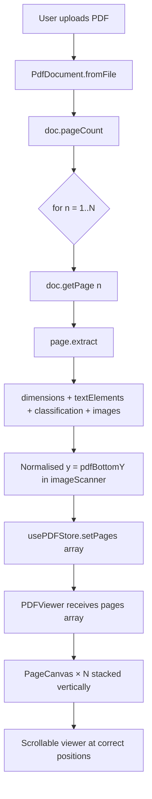

# Implementation Plan — Edit Page: Accurate PDF Rendering

## Goal

Fix the editing page so the user sees a pixel-accurate reconstruction of every page in their uploaded PDF — images at the right position, text at the right position, with the full multi-page document visible in a scrollable viewer.

---

## Root-Cause Analysis

### Bug 1 — Image Y-coordinate is wrong (the main culprit)

PDF images are painted via a CTM (Current Transformation Matrix):
```
[a  b  c  d  e  f] cm
/Im0 Do
```
where `a` = rendered width, `d` = rendered height, `e` = x-position, `f` = y-position.

**Critical detail:** Many PDF generators flip images vertically by using a **negative `d`**.

| `d` sign | What `f` (matrix[5]) means |
|----------|----------------------------|
| `d > 0`  | **Bottom**-left of the image in PDF space |
| `d < 0`  | **Top**-left of the image in PDF space |

**Current code in `imageScanner.js`** always stores `y: op.matrix[5]` unconditionally, then `PDFViewer.jsx` always subtracts `renderedHeight` to convert to CSS top:
```js
// toCanvasY(img.y, img.renderedHeight, pageHeight, scale)
cssY = (pageHeight - img.y - img.renderedHeight) * scale
```

**Example of the failure** — a full-page background image with `d = -792, f = 792`:
- Current code: `cssY = (792 - 792 - 792) * scale = -792 * scale` → image drawn 792px **above** the page 🐛
- Correct:      `cssY = (792 - 792) * scale = 0` → top of page ✓

**The fix:** normalise all appearance `y` values to be **bottom-left in PDF space** before storing them. Then `toCanvasY` works correctly in all cases.

---

### Bug 2 — Text Y uses wrong height for baseline correction

In PDF, the `Tm` operator gives the **baseline** Y of the text. The current code:
```js
// PDFViewer.jsx
const cssY = toCanvasY(el.y, el.fontSize ?? 12, pageHeight, scale);
// = (pageHeight - el.y - fontSize) * scale
```
This subtracts a full `fontSize` from the baseline, placing the **top of the div** one full em above the baseline. But since the div's text has a baseline at ~`0.8em` from the div top, the visual baseline ends up `0.2em` too high — causing text to overlap images above it instead of sitting neatly below them.

**The fix:** subtract only `fontSize * 0.8` (the standard ascent fraction) so the div top aligns with the top of the glyph bounding box, not above it.

---

### Bug 3 — Only page 1 is ever parsed or displayed

- `PdfDocument.#resolvePageN(n)` calls `extractFirstKid()` which **always returns Kids[0]**, ignoring `n`.
- `PdfPageTreeResolver` has no function to extract the Nth kid.
- `EditingPage.jsx` hard-codes `doc.getPage(1)` and never loops pages.
- `PDFViewer.jsx` accepts only one page's data and renders a single fixed-height box.
- `usePDFStore` holds only one page's content.

---

### Bug 4 — Background detector misclassifies regular images as background

In `backgroundDetector.js`, `detectBackgroundObject` has a **fallback** that was intended as a last resort:

```js
// If no image covers ≥80%, return the one with the most coverage anyway
return bestObjNum !== null ? { objNum: bestObjNum, matrix: bestMatrix } : null;
```

**The problem:** Any PDF whose images don't cover ≥80% of the page (most normal PDFs with photos, diagrams, etc.) still gets its largest image flagged as "background" — even if it covers only 5% of the page. This means all images get assigned `role: 'background'` and end up in `images.background` instead of `images.pageImages`. Layer 1 (page images) is always empty.

**The fix:** Remove the fallback entirely. Only return a background when an image genuinely covers ≥80% of the page.

```js
// After: strict threshold only
return null;  // Only classify as background if coverage ≥ 80%
```

---

### Bug 5 — `targetPageObj` string comparison in `scanPageImages` always fails, emptying `pageImages`

In the previous plan, `scanPageImages` was given a `targetPageObj` parameter to restrict scanning to one page:

```js
if (targetPageObj && pageObjStr !== targetPageObj) continue;
```

**The problem:** `targetPageObj` is `this.#pageObj` from `getObject()` which returns just the dictionary content (e.g. `<< /Type /Page ... >>`). But `pageObjStr` in the loop is `match[0]` from a different regex (`PDF_REGEX.images.pageObjectBlock`) which includes the full object header (`5 0 obj\n<< /Type /Page ... >>\nendobj`). **These two strings are structurally different and will never be equal**, so the `continue` fires for every page — `allObjectIds` ends up empty — and `pageImages` is always `[]`.

Combined with Bug 4, this means:
- ALL images get put into `images.background` (Bug 4)
- `images.pageImages` is always empty (Bug 5)
- Commenting out Layer 0 reveals nothing, because pageImages is empty

**The fix:** Remove `targetPageObj` from `scanPageImages` entirely. Instead, in `PdfPage.getImages()`, build the XObject name map from `this.#pageObj` to get the set of object numbers that belong to this page, then filter `scanPageImages` results by those object numbers:

```js
// In PdfPage.getImages()
const nameMap     = buildXObjectNameMap(this.#bytes, this.#pdfString, this.#pageObj);
const pageObjNums = new Set(nameMap.values());

let pageImgs = await scanPageImages(this.#bytes, this.#pdfString);
pageImgs = pageImgs.filter(img => pageObjNums.has(img.objNum));  // ← correct filter
```

This is reliable because `buildXObjectNameMap` operates directly on `this.#pageObj` — the same string used everywhere else for this page.

---

### Bug 6 — Page image coordinates read from wrong location (`undefined` → `NaN` position)

In `PDFViewer.jsx`, the `PageCanvas` sub-component renders page images like this:

```jsx
{(images.pageImages ?? []).map((img, idx) => {
  const cssX = img.x * scale;              // img.x is undefined!
  const cssY = toCanvasY(img.y, img.renderedHeight, pageHeight, scale);
  const cssW = img.renderedWidth * scale;
  const cssH = img.renderedHeight * scale;
```

**The problem:** Image objects returned by `scanPageImages` have the shape:

```js
{
  dataUrl, metadata, format, extension,  // decoded image data
  objNum,
  role: 'image',
  appearances: [
    { x, y, renderedWidth, renderedHeight }  // ← position/size is HERE
  ]
}
```

The properties `x`, `y`, `renderedWidth`, `renderedHeight` **do not exist at the top level** of the image object — they live inside `img.appearances[0]`. So `img.x` is `undefined`, `img.x * scale` is `NaN`, and the image is rendered at position `NaN` — which browsers silently interpret as `0` or ignore, causing all images to pile up at the top-left corner of the page regardless of their actual position in the PDF.

**The fix:** Read position/size data from `img.appearances[0]` in `PageCanvas`:

```jsx
{(images.pageImages ?? []).map((img, idx) => {
  const ap = img.appearances?.[0];
  if (!ap) return null;  // skip images with no paint occurrence on this page

  const cssX = ap.x * scale;
  const cssY = toCanvasY(ap.y, ap.renderedHeight, pageHeight, scale);
  const cssW = ap.renderedWidth * scale;
  const cssH = ap.renderedHeight * scale;
```

> [!NOTE]
> An image can appear more than once on a page (e.g., a repeated watermark). If needed, map over `img.appearances` instead of `appearances[0]` to render every occurrence. For now, rendering the first appearance is sufficient.

---

## Decisions

> [!NOTE]
> **D1 — Multi-page extraction strategy:** All pages are extracted **upfront** on upload (simpler, consistent). Lazy extraction can be added later as an optimisation for very large PDFs if needed.

> [!NOTE]
> **D2 — Page separator styling:** Each page in the scrollable viewer will have a **subtle drop-shadow + page number badge** for a professional look.

---

## Proposed Changes

### Layer 1 — `pdf-parser` SDK (coordinate normalisation + multi-page)

---

#### [MODIFY] [pdfPageTreeResolver.js](file:///c:/Users/Krishanu/OneDrive/Desktop/Learning%20Coding/PDF-Editor/pdf-parser/src/core/pdfPageTreeResolver.js)

Add `extractKidN(pagesObjStr, refId, n)` alongside the existing `extractFirstKid`.

```js
/**
 * Extracts the Nth (0-indexed) child reference from a /Kids array.
 */
export function extractKidN(pagesObjStr, refId, n) {
    const kidsMatch = pagesObjStr.match(PDF_REGEX.core.kidsArray);
    if (!kidsMatch) throw new Error(`/Kids not found in ${refId}`);
    const tokens = kidsMatch[1].trim().split(PDF_REGEX.common.whitespace);
    const base   = n * 3;   // each ref = "ObjNum GenNum R" = 3 tokens
    if (base + 2 >= tokens.length) throw new Error(`Page ${n + 1} out of range`);
    return `${tokens[base]} ${tokens[base + 1]} ${tokens[base + 2]}`;
}

/**
 * Returns the total page count from a /Count entry.
 */
export function extractPageCount(pagesObjStr) {
    const match = pagesObjStr.match(/\/Count\s+(\d+)/);
    return match ? parseInt(match[1], 10) : 1;
}
```

> [!NOTE]
> `extractFirstKid` is kept unchanged — it is still used in non-critical paths and keeping it avoids any breakage.

---

#### [MODIFY] [PdfDocument.js](file:///c:/Users/Krishanu/OneDrive/Desktop/Learning%20Coding/PDF-Editor/pdf-parser/PdfDocument.js)

1. Add `get pageCount()` — reads `/Count` from the Pages node.
2. Fix `#resolvePageN(n)` to call `extractKidN(pagesObj, pagesRef, n - 1)` so page numbers are respected.

```js
// New getter
get pageCount() {
    const rootRef  = findRootRef(this.#pdfString);
    const rootObj  = getObject(this.#bytes, this.#pdfString, rootRef);
    const pagesRef = extractValue(rootObj, '/Pages');
    const pagesObj = getObject(this.#bytes, this.#pdfString, pagesRef);
    return extractPageCount(pagesObj);
}

// Fix #resolvePageN to use extractKidN
const pageRef = extractKidN(pagesObj, pagesRef, n - 1);  // n is 1-indexed
```

---

#### [MODIFY] [imageScanner.js](file:///c:/Users/Krishanu/OneDrive/Desktop/Learning%20Coding/PDF-Editor/pdf-parser/src/images/imageScanner.js)

**This is the most critical bug fix.** Normalise `y` to always be the **bottom-left** Y in PDF user-space before storing it in `appearances`:

```js
// In buildAppearancesForPage → the push inside the loop:
const d           = op.matrix[3];   // y-scale (may be negative = image flipped)
const f           = op.matrix[5];   // PDF y of image origin
// When d < 0, f is the TOP of the image → bottom = f + d (f + negative)
const pdfBottomY  = d < 0 ? f + d : f;

appearancesMap.get(objNum).push({
    x:              op.matrix[4],
    y:              pdfBottomY,          // ← always bottom-left, safe for toCanvasY
    renderedWidth:  Math.abs(op.matrix[0]),
    renderedHeight: Math.abs(d),
});
```

---

#### [MODIFY] [backgroundDetector.js](file:///c:/Users/Krishanu/OneDrive/Desktop/Learning Coding/PDF-Editor/pdf-parser/src/images/backgroundDetector.js)

Two fixes in this file:

**1. Y-normalisation** in `extractBackgroundImage` (appearances array):

```js
const d          = matrix[3];
const f          = matrix[5];
const pdfBottomY = d < 0 ? f + d : f;

appearances: [{
    x:              matrix[4],
    y:              pdfBottomY,          // ← normalised
    renderedWidth:  Math.abs(matrix[0]),
    renderedHeight: Math.abs(d),
}]
```

**2. Remove fallback in `detectBackgroundObject`** (Bug 4 fix):

```js
// Remove this line:
// return bestObjNum !== null ? { objNum: bestObjNum, matrix: bestMatrix } : null;

// Replace with:
return null;  // Only classify as background if coverage ≥ 80%
```

> [!NOTE]
> The `computePageCoverage` function already uses `Math.abs(matrix[0]) * Math.abs(matrix[3])` so it's unaffected.

---

#### [MODIFY] [imageScanner.js](file:///c:/Users/Krishanu/OneDrive/Desktop/Learning%20Coding/PDF-Editor/pdf-parser/src/images/imageScanner.js)

> [!CAUTION]
> The `targetPageObj` parameter added in the previous plan is **removed** (Bug 5 fix). The string comparison `pageObjStr !== targetPageObj` between two differently-sourced strings always fails, causing `pageImages` to be permanently empty.

`scanPageImages` reverts to scanning all pages; per-page filtering is handled in `PdfPage.getImages()` by object number (see below):

```js
// Correct signature — no targetPageObj:
export async function scanPageImages(bytes, pdfString)
```

---

#### [MODIFY] [PdfPage.js](file:///c:/Users/Krishanu/OneDrive/Desktop/Learning%20Coding/PDF-Editor/pdf-parser/PdfPage.js)

Replace the broken `targetPageObj` string filter with an **object-number-based filter** (Bug 5 fix):

```js
import { buildXObjectNameMap } from './src/images/pageContentParser.js';

async getImages() {
    const bg = await extractBackgroundImage(...);

    // Get all object numbers that belong to THIS page
    const nameMap     = buildXObjectNameMap(this.#bytes, this.#pdfString, this.#pageObj);
    const pageObjNums = new Set(nameMap.values());

    // Scan full PDF but filter to this page's objects only
    let pageImgs = await scanPageImages(this.#bytes, this.#pdfString);
    pageImgs = pageImgs.filter(img => pageObjNums.has(img.objNum));

    if (bg) {
        pageImgs = pageImgs.filter(img => img.objNum !== bg.objNum);
    }

    return { background: bg, pageImages: pageImgs };
}
```

---

### Layer 2 — Frontend State (`usePDFStore`)

---

#### [MODIFY] [usePDFStore.js](file:///c:/Users/Krishanu/OneDrive/Desktop/Learning%20Coding/PDF-Editor/frontend/src/store/usePDFStore.js)

Change the store to hold an **array of page data** instead of a single page:

```js
// Before
extractedContent: null,   // single page
extractedImages: null,    // single page
pageDimensions: { width: 612, height: 792 },

// After
pages: [],   // Array<{ dimensions, textElements, classification, images }>
pageCount: 0,
```

Add `setPages(pagesArray)` and `setPageCount(n)` actions. Remove `setExtractedData` / `setPageDimensions`.

---

### Layer 3 — Frontend Orchestration (`EditingPage.jsx`)

---

#### [MODIFY] [EditingPage.jsx](file:///c:/Users/Krishanu/OneDrive/Desktop/Learning%20Coding/PDF-Editor/frontend/src/pages/EditingPage.jsx)

Replace the single-page extraction loop with a multi-page loop:

```js
const doc   = await PdfDocument.fromFile(currentPDF);
const count = doc.pageCount;
const pages = [];

for (let n = 1; n <= count; n++) {
    const page   = await doc.getPage(n);
    const result = await page.extract();
    pages.push(result);   // { dimensions, textElements, classification, images }
}

setPages(pages);
setPageCount(count);
```

Remove `setPageDimensions` / `setExtractedData` calls; replace with `setPages`.

Pass `pages` array to `PDFViewer`.

---

### Layer 4 — Frontend Rendering (`PDFViewer.jsx`)

---

#### [MODIFY] [PDFViewer.jsx](file:///c:/Users/Krishanu/OneDrive/Desktop/Learning%20Coding/PDF-Editor/frontend/src/components/PDFViewer.jsx)

This is the most significant frontend change. Three sub-fixes:

**A. Fix `toCanvasY` for text (baseline correction)**

```js
// Before (subtracts full fontSize → baseline ends up too high)
const cssY = toCanvasY(el.y, el.fontSize ?? 12, pageHeight, scale);

// After (subtract only the ascent fraction ~80% of fontSize)
const ascent = (el.fontSize ?? 12) * 0.8;
const cssY   = toCanvasY(el.y, ascent, pageHeight, scale);
```

**B. Convert from single-page props to `pages` array prop**

```jsx
// Before
const PDFViewer = ({ pageWidth, pageHeight, textElements, classification, images, ... }) => { ... }

// After
const PDFViewer = ({ pages = [], isLoading, selectedTool }) => { ... }
```

**C. Scrollable multi-page layout**

Wrap all page canvases in a `div` with `overflow-y: auto` and a fixed `maxHeight` (e.g., `calc(100vh - 180px)`). Each page renders as its own absolute-positioned box, stacked vertically with a gap:

```jsx
<div
  id="pdf-scroll-container"
  style={{
    overflowY: 'auto',
    maxHeight: 'calc(100vh - 180px)',
    background: '#e5e7eb',    // grey inter-page area
    padding: '24px 0',
    display: 'flex',
    flexDirection: 'column',
    alignItems: 'center',
    gap: 24,
  }}
>
  {pages.map((page, pageIdx) => (
    <PageCanvas
      key={pageIdx}
      page={page}
      pageNumber={pageIdx + 1}
      selectedTool={selectedTool}
    />
  ))}
</div>
```

Extract a `PageCanvas` sub-component that receives one page's `{ dimensions, textElements, classification, images }` and renders the 3 layers (background → page images → text) exactly as the current code does for a single page, but with the **fixed coordinate normalisation**.

**D. Read position from `img.appearances[0]` in `PageCanvas`** — Bug 6 fix

> [!CAUTION]
> The current code reads `img.x`, `img.y`, `img.renderedWidth`, `img.renderedHeight` at the top level of the image object. These properties are `undefined` — they live inside `img.appearances[0]`. All images therefore render at `NaN` coordinates (visually: top-left corner).

```jsx
// Before (WRONG — img.x is undefined)
const cssX = img.x * scale;
const cssY = toCanvasY(img.y, img.renderedHeight, pageHeight, scale);
const cssW = img.renderedWidth * scale;
const cssH = img.renderedHeight * scale;

// After (CORRECT — read from appearances[0])
const ap = img.appearances?.[0];
if (!ap) return null;  // no paint occurrence recorded for this page

const cssX = ap.x * scale;
const cssY = toCanvasY(ap.y, ap.renderedHeight, pageHeight, scale);
const cssW = ap.renderedWidth * scale;
const cssH = ap.renderedHeight * scale;
```

**E. Image dimensions: relative to page, not to CANVAS_WIDTH**

> [!IMPORTANT]
> The user specifically noted: *"The picture dimensions are taken relative to the main editing sheet in the editing page and not the whole page"*. This is already the correct interpretation — `renderedWidth` and `renderedHeight` from the CTM are in **PDF points** (same coordinate space as `pageWidth`/`pageHeight`). Multiplying by `scale = CANVAS_WIDTH / pageWidth` correctly converts them to CSS pixels relative to the canvas. No special treatment is needed here — the Y-flip fix above is what was actually causing the visual issue.

---

## Data-Flow Diagram (after fix)



---

## Files Changed Summary

| File | Change |
|------|--------|
| `pdf-parser/src/core/pdfPageTreeResolver.js` | Add `extractKidN`, `extractPageCount` |
| `pdf-parser/PdfDocument.js` | Add `pageCount` getter, fix `#resolvePageN` to use `extractKidN` |
| `pdf-parser/src/images/imageScanner.js` | **Normalise `y` to bottom-left**; **remove broken `targetPageObj` filter** (Bug 5) |
| `pdf-parser/src/images/backgroundDetector.js` | **Normalise `y` to bottom-left**; **remove fallback that misclassified regular images as background** (Bug 4) |
| `pdf-parser/PdfPage.js` | Add `buildXObjectNameMap` import; **filter `pageImages` by object number** instead of fragile string comparison (Bug 5) |
| `frontend/src/store/usePDFStore.js` | Replace single-page fields with `pages[]` + `pageCount` |
| `frontend/src/pages/EditingPage.jsx` | Loop all pages, call `setPages()` |
| `frontend/src/components/PDFViewer.jsx` | Multi-page `pages[]` prop, scrollable container, baseline fix, extract `PageCanvas` sub-component; **read image position from `img.appearances[0]`** (Bug 6) |

---

## Verification Plan

### Automated
- Test with `Photo file.pdf` (image + text below) → image and text must not overlap.
- Test with `2 images file.pdf` → both images visible in correct positions.
- Test with `pngjpg.pdf` → both PNG and JPEG images render correctly.
- Test with a multi-page PDF → all pages visible in scroll, each in correct position.

### Visual Check via Browser
After running `npm run dev` in `frontend/`:
1. Upload `Photo file.pdf` — image should appear where it is in the PDF; text should appear below/around it without overlap.
2. Upload `2 images file.pdf` — scroll down; second image should appear where expected.
3. Upload a multi-page PDF — scrolling should reveal all pages stacked one below the other with page number labels.
